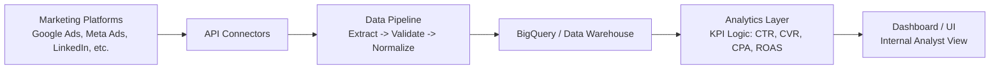

# Simple Architecture Workflow (v1)

## Workflow Overview
This v1 design keeps the system intentionally simple and reliable for internal analyst use.

## Component Notes
- Marketing Platforms: source systems for spend, impressions, clicks, conversions, and revenue.
- API Connectors: lightweight ingestion scripts/jobs to fetch channel data.
- Data Pipeline: standardizes schemas, handles null/type issues, and applies quality checks.
- BigQuery/Data Warehouse: centralized storage for queryable cross-channel data.
- Analytics Layer: computes standardized KPIs and focus guidance.
- Dashboard/UI: presents channel performance and recommended focus areas.

## Why This Fits v1
- Minimal moving parts
- Easy to explain and operate
- Supports consistent reporting without changing existing tools
