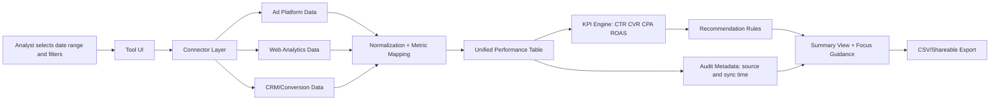

# Task 1 Architecture Diagram

## System Flow (v1)

## Architecture Notes
- The design wraps existing tools instead of replacing them.
- A lightweight normalization layer standardizes metric names and types.
- Recommendation logic is deterministic in v1 for explainability.
- Audit metadata improves trust and debugging.
